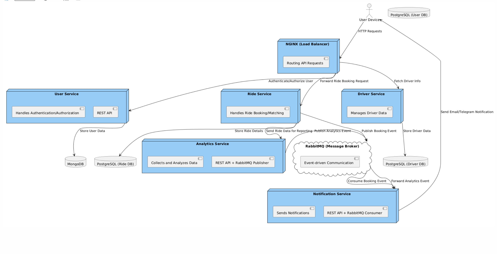
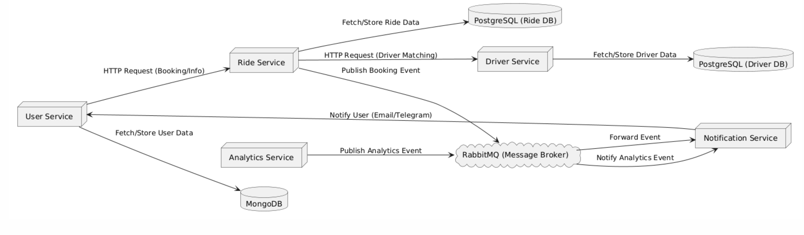

# Ride-Hailing Backend

## Overview

The Ride-Hailing Backend is a distributed system built using **microservice architecture**, designed to handle the diverse requirements of a ride-hailing platform. The system consists of multiple independent services, each focusing on specific responsibilities, such as managing users, drivers, payments, rides, notifications, and analytics.

We primarily employ the **Model-View-Controller (MVC)** architectural pattern for our Node.js services, while the Django-based Ride Service follows the **Model-View-Template (MTV)** pattern, ensuring consistency and maintainability across the system.

## Architecture

## System Architecture
Below is the **System Architecture Diagram**:




### Key Features of Microservice Architecture

1. **Independence**: Each service is independently developed, deployed, and scaled.
2. **Loosely Coupled**: Services communicate via APIs, ensuring minimal dependency.
3. **Technology Flexibility**: Each service uses the technology best suited to its requirements.
4. **Fault Tolerance**: Failures in one service do not cascade across the system.
5. **Scalability**: Each service can scale independently based on traffic and resource demands.

### Architectural Patterns

- **MVC (Model-View-Controller)**: Used for Node.js-based services to maintain separation of concerns:

  - **Model**: Handles data and business logic.
  - **View**: Responsible for presenting the output (not directly applicable for backend APIs).
  - **Controller**: Processes incoming requests and delegates logic to the service layer.

- **MTV (Model-View-Template)**: Used in Django for the Ride Service:
  - **Model**: Defines the database structure.
  - **View**: Handles business logic and queries models.
  - **Template**: Renders the UI (not extensively used in an API-driven backend).

---

## Services Overview

### 1. Driver Service (Node.js, MVC)

- **Purpose**: Manages driver data, onboarding, and statuses.
- **Technology**: Node.js, Express, TypeScript.
- **Responsibilities**:
  - Driver registration and management.
  - Real-time status updates (e.g., availability).

**Endpoints:**

| Method | Endpoint           | Description                         |
|--------|--------------------|-------------------------------------|
| `POST` | `/register`        | Register a new driver               |
| `GET`  | `/drivers`         | Fetch a list of all drivers         |
| `GET`  | `/drivers/:id`     | Get details of a specific driver    |
| `PUT`  | `/drivers/:id`     | Update driver details               |
| `DELETE` | `/drivers/:id`   | Delete a driver                     |


### 2. User Service (Node.js, MVC)

- **Purpose**: Handles user authentication and profile management.
- **Technology**: Node.js, Express, TypeScript.
- **Responsibilities**:
  - User registration and login.
  - Managing user profiles and preferences.

**Endpoints:**

| Method | Endpoint           | Description                |
|--------|--------------------|----------------------------|
| `POST` | `/register`        | Register a new user        |
| `POST` | `/login`           | Login an existing user     |
| `GET`  | `/profile`         | Get user profile details   |

### 3. Ride Service (Django, MTV)

- **Purpose**: Manages ride requests, matching, and ride tracking.
- **Technology**: Django, Python.
- **Responsibilities**:
  - Matching drivers to users based on proximity and availability.
  - Ride status management (e.g., booked, ongoing, completed).

**Endpoints:**

| Method | Endpoint                   | Description                      |
|--------|----------------------------|----------------------------------|
| `POST` | `/booking`                 | Book a new ride                  |
| `POST` | `/booking/:id/accept-ride` | Accept a ride                    |
| `POST` | `/booking/:id/cancel-ride` | Cancel a ride                    |
| `GET`  | `/booking/:id`             | Get ride details by ride ID      |
| `PUT`  | `/booking/:id/start`       | Start a ride                     |
| `PUT`  | `/booking/:id/end`         | End a ride and calculate fare    |
| `DELETE` | `/booking/:id`           | Delete a ride request            |
| `GET`  | `/ride-requests`           | Get all ride requests            |
| `GET`  | `/ride-requests/:id`       | Get ride request by id           |
| `PUT`  | `/ride-requests/:id/update`| Update ride request by id        |
| `DELETE` | `/ride-requests/:id`     | Delete a ride request            |


### 4. Payment Service (Node.js, MVC)

- **Purpose**: Processes payments and handles transactions securely.
- **Technology**: Node.js, Express, TypeScript.
- **Responsibilities**:
  - Payment gateway integration.
  - Transaction tracking and refunds.

### 5. Notification Service (Node.js, MVC)

- **Purpose**: Sends real-time notifications to users and drivers.
- **Technology**: Node.js, Express, TypeScript.
- **Responsibilities**:
  - Multi-channel notifications (Email, Telegram).
  - Customizable notification templates.

**Endpoints:**

| Method | Endpoint           | Description                         |
|--------|--------------------|-------------------------------------|
| `POST` | `/send-email`      | Send an email notification          |
| `POST` | `/send-telegram`   | Send a Telegram notification        |

### 6. Analytics and Reporting Service (Nest.js, MVC)

- **Purpose**: Generates analytics and reports for business insights.
- **Technology**: Nest.js, TypeScript.
- **Responsibilities**:
  - Collecting and analyzing service data.
  - Generating usage reports and KPIs.

---

## Communication Flow
Below is the **Communication Flow Diagram**:


---

## Technology Stack

| Service                  | Technology            | Architecture |
| ------------------------ | --------------------- | ------------ |
| **Driver Service**       | Node.js, Express, MVC | MVC          |
| **User Service**         | Node.js, Express, MVC | MVC          |
| **Ride Service**         | Django, MTV           | MTV          |
| **Payment Service**      | Node.js, Express, MVC | MVC          |
| **Notification Service** | Node.js, Express, MVC | MVC          |
| **Analytics Service**    | Nest.js, MVC          | MVC          |

---

## Scalability and Fault Tolerance

- **Horizontal Scaling**: Each service can be scaled independently.
- **Database Isolation**: Each service uses a dedicated database to ensure autonomy.
- **Resilience**: Services are loosely coupled to prevent cascading failures.

---

## Security

- **Authentication**: User and driver authentication via secure tokens (e.g., JWT).
- **Data Encryption**: All sensitive data is encrypted in transit and at rest.
- **API Gateway**: Centralized API gateway for secure communication and routing.

---

## Installation and Deployment

### Prerequisites

- Docker (recommended for containerized deployment).
- Node.js, Python, and PostgreSQL installed locally (if not using Docker).

### Steps

1. Clone the repositories for all services.

   ```bash
   git clone <repository_url>
   ```

2. Set up `.env` files for each service with appropriate configurations.

3. Run services:

   - Using Docker Compose:
     ```bash
     docker-compose up --build
     ```
   - Or manually start each service:
     ```bash
     npm start # Node.js services
     python manage.py runserver # Django service
     ```

4. Access APIs via the centralized API Gateway or directly at their respective endpoints.

---

## Future Improvements

- **Event-Driven Architecture**: Introduce message queues for inter-service communication.
- **Load Balancing**: Implement load balancers to distribute traffic.
- **Push Notifications**: Integrate push notification services (e.g., Firebase).

This README provides a comprehensive guide to the architecture, components, and setup of the Ride-Hailing Backend.
